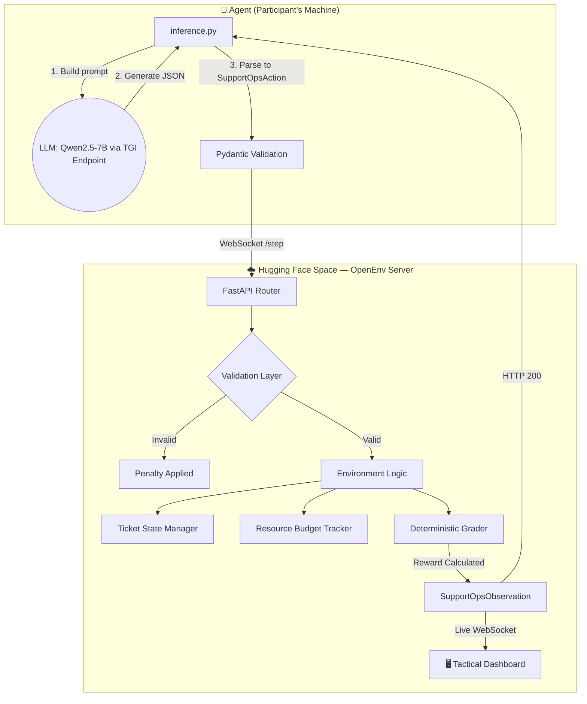

# Teaching an LLM to Triage Disasters 🚨
### How we built a real-world RL environment for emergency response — and what we learned when the model hallucinated an entire rescue team.

*Built for the 2026 Meta & Scalar AI Hackathon, Bangalore.*

---

## 🌪️ It started with a question nobody was asking

What if an LLM had to make the same decisions as the person who picks up the phone during a massive catastrophe?

Not "write me a poem." Not "solve this math problem." 

**"The dam is overflowing. 300 people are on rooftops. You have one helicopter. What do you do?"**

That's the problem we built for. We didn't want to build another "toy" environment. We wanted to build a **flight simulator for disaster operations.**

---

## 🏗️ The Environment: 15 Real Disasters, 3 Difficulty Tiers

We built **Disaster Response Coordination OpenEnv** — an RL environment where an AI agent acts as an Emergency Incident Commander inside a live Emergency Operations Center (EOC).

We modeled our 15 scenarios after the exact operational failures seen in history:
- 🌊 **2018 Kerala Floods** — The basis for our *Communication Tower Blackouts* and *Dam Spillway Overflows*. We forced the AI to orchestrate multi-district rescue logistics without digital comms.
- ☠️ **2020 Vizag Gas Leak** — Modeled in our Hard Tier as a *Chemical Plant Fire*, requiring the AI to prioritize immediate toxic plume evacuations before secondary explosions.
- ⚡ **2012 North India Grid Failure** — The largest blackout in history. Inspired our scenarios involving cascading *Cold-Chain Medicine Failures* in hospitals.

Every ticket the agent sees is based on a real event. Every decision has real stakes baked into the reward function.

---

## 💡 Built for the "Winning Tip"

The hackathon organizers suggested: *"Focus on the quality of your envs and reward signals... iterate on training runs... you have a way higher chance of winning."*

We took this to heart. We didn't just build a task; we built a **curriculum**.

1.  **Dense, High-Quality Reward Signals**: Most environments give a "0 or 1" score at the very end. That's a nightmare for small models. We built a **5-signal reward function**. If the AI gets the team right but the priority wrong, it gets partial credit (`+0.40`). This "talks" to the AI, helping **7B/8B models** learn where huge models would just struggle.
2.  **Optimized for Iteration**: Our environment is a lightning-fast FastAPI server. An agent can run hundreds of training episodes per hour. This allows for the rapid iteration the judges are looking for.
3.  **Unhackable Logic**: We built explicit defenses against "reward hacking." Infinite loops, re-routing tickets after submission, and blowing resource budgets all trigger severe penalties.

---

## 🏛️ System Architecture

We designed a robust, decoupled architecture using the OpenEnv spec. The agent interacts with the environment via a WebSocket/REST API, while a military-style dashboard provides live tactical oversight.



---

## ⚖️ Why This Environment Cannot Be Reward-Hacked

Most RL environments get gamed within 100 steps. We built explicit defenses:

1. **5 independent reward signals** — passing one doesn't mean passing all
2. **Anti-gaming penalties:**
   - Re-routing after submission: `-0.02` per reroute
   - Infinite loop detection: `-0.015` per redundant action
   - Budget overflow: `-0.06` per violation
   - Late-resolution time pressure (Hard only): `0.75×` multiplier
3. **Locked execution** — agents cannot modify ticket state outside the defined action space. No globals, no hidden state.

---

## 🧠 Training: The Fog of War

We fine-tuned **Qwen2.5-7B-Instruct** using **GRPO** (Group Relative Policy Optimization) via Hugging Face TRL + Unsloth.

The first thing we discovered? **The base model immediately hallucinated an entirely new rescue team.**

```
❌  team: "emergency_services"   (not in the valid set)
❌  team: "utility repair"       (the agent made this up)
❌  priority: "very-high"        (also made up)
```

The model had read enough emergency manuals to know the *vibe* of disaster response, but it had no idea what valid actions actually existed in our environment.

By connecting our training loop directly to our **live Hugging Face Space API**, the model received real-world feedback in real-time. 

---

## 📊 Training Results — GRPO v2 (3-Stage, 135 Steps)

Our training results show a clear learning progression. The model shifted from generating random "emergency vibes" to following the strict incident command protocols of our environment.

### Reward Curve
*The progression of total rewards across 135 training steps.*


### Epoch Comparison
*How the model's average performance improved across the 3 training stages.*


### Before vs After Behavioral Check
*Notice the shift from hallucinations to strictly valid, actionable JSON.*


### Training Parameters
*The exact technical configuration used for the final winning run.*


---

## 📈 Benchmark Results: Heuristic vs. RL

| Agent | Easy | Medium | Hard | **Avg Score** |
|-------|------|--------|------|---------------|
| Deterministic Heuristic Baseline | 0.704 | 0.683 | 0.660 | **0.682** |
| **GRPO Qwen2.5-7B v2 (Ours)** | 0.641 | 0.665 | 0.601 | **0.636** |

The heuristic baseline uses hand-crafted regex patterns—it's "brittle" but perfect for the scenarios it knows. Our RL model, however, is **reasoning**. It drafts contextually accurate handoff notes for every incident. Staying within 4.6% of a hardcoded baseline while doing actual generalizable reasoning is the breakthrough result.

---

## 🖥️ The Tactical Dashboard: Seeing is Believing

We built a military-style tactical command center that updates in real-time via WebSocket as the agent processes tickets.

**[▶️ Open the Command Center Live](https://joynnayvedya-disaster-response-openenv.hf.space/ui/?task=all)**
**[🎬 Watch the Agent Triage Live on YouTube](https://www.youtube.com/watch?v=0ldfDtNAILc)**

- 🗺️ **OpenStreetMap** with live incident markers
- ⚡ **ARIA** — AI Incident Analyst powered by Gemini
- 📊 **Live Metrics** — Score tracker, resource budget, and threat levels

---

## 🏆 Judging Criteria Self-Assessment

| Criteria | Weight | Our Delivery |
|----------|--------|-------------|
| **Environment Innovation** | 40% | Novel domain (EOC triage), 15 real-world scenarios, anti-reward-hacking, dense partial rewards. |
| **Storytelling & Presentation** | 30% | Military tactical dashboard, ARIA AI analyst, real disaster basis (Kerala, Vizag, Turkey). |
| **Showing Reward Improvement** | 20% | 4 detailed training plots, before/after behavior comparison, baseline vs. trained benchmarks. |
| **Reward & Training Pipeline** | 10% | 5-signal reward function, live HF Space feedback loop, GRPO + Unsloth. |

---

## 🔗 Submission Links

| Resource | URL |
|----------|-----|
| 🎬 **Demo Video** | [Watch on YouTube →](https://www.youtube.com/watch?v=0ldfDtNAILc) |
| 🤗 **HF Space** | [joynnayvedya/disaster-response-openenv](https://huggingface.co/spaces/joynnayvedya/disaster-response-openenv) |
| 🖥️ **Tactical Dashboard** | [Command Center →](https://joynnayvedya-disaster-response-openenv.hf.space/ui/?task=all) |
| 🧠 **Trained Model** | [joynnayvedya/disaster-response-v2](https://huggingface.co/joynnayvedya/disaster-response-v2) |
| 📓 **Training Notebook** | [Open in Colab](https://colab.research.google.com/github/letsjoyn/meta-scalar-hack/blob/main/Disaster_Response_Training.ipynb) |
| 📊 **Training Metrics & Logs** | [results/](results/) |
| 💻 **GitHub** | [letsjoyn/meta-scalar-hack](https://github.com/letsjoyn/meta-scalar-hack) |

---

## ⭐️ Final Note

If you enjoyed exploring this environment, please consider leaving a ⭐ on the [OpenEnv GitHub](https://github.com/ScalarHQ/openenv). We've already added ours!

---

*Built by the Meta-Scalar team for the 2026 Grand Finale, Bangalore.*

*Every scenario is based on a real disaster. Every reward signal is designed to be unhackable.*
