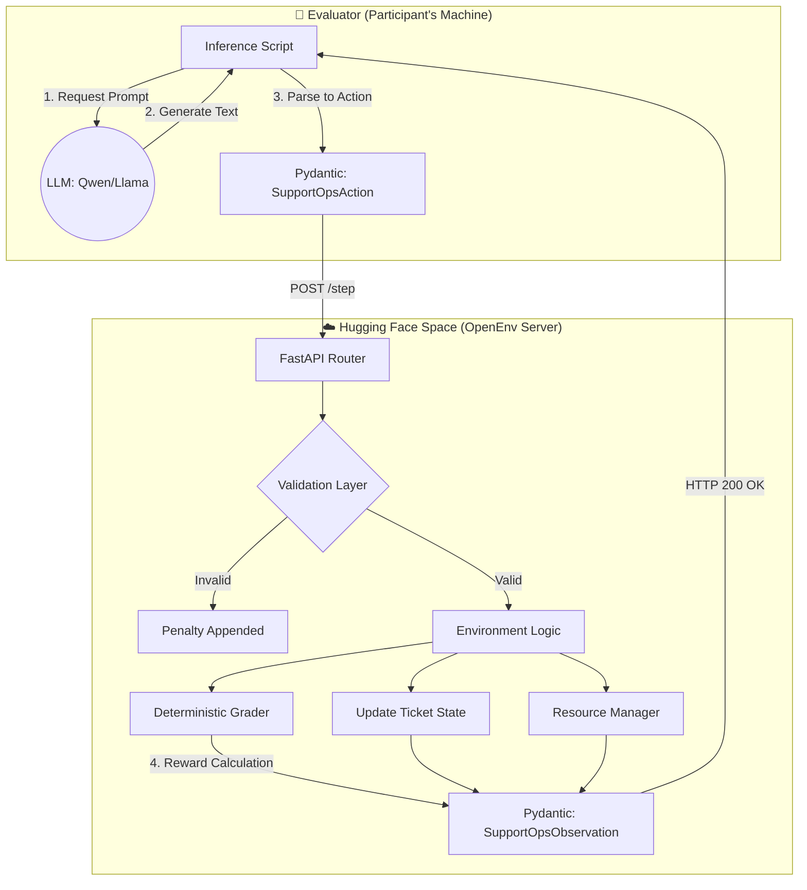
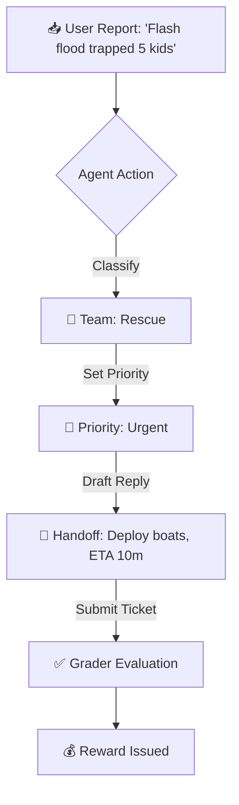

<div align="center">
  <h1>🚨 Disaster Response Coordination OpenEnv</h1>
  <p><strong>A Real-World OpenEnv Simulator for AI Emergency Incident Command</strong></p>
  
  <p>
    <a href="https://huggingface.co/spaces/joynnayvedya/disaster-response-openenv"><strong>🌍 View Live on Hugging Face Spaces</strong></a>
  </p>
</div>

---

## 🌪️ The Problem: Scaling Emergency Response
During a natural disaster, **Emergency Operations Centers (EOCs)** are overwhelmed by thousands of frantic calls. Distinguishing between a stranded cat and a chemical plant explosion can mean the difference between life and death. 

While most AI environments simulate video games or simple web forms, this OpenEnv simulates the **fog of war**. Agents must route incidents, triage urgency, drafted execution plans, and manage extremely limited resources (rescue helicopters, generators, etc.) while avoiding cascading failures.
### 📰 Ripped From The Headlines: Based on True Events
To guarantee **maximum real-world utility**, the 15 simulated scenarios in this environment were directly modeled after the operational failures seen in historical disasters:
*   **The 2021 Texas Power Freeze:** Inspired our "Medium Tier" scenario involving cascading *Cold-Chain Medicine Failures* when power grids collapsed.
*   **The 2023 Ohio Train Derailment:** Modeled in our "Hard Tier" as a *Chemical Plant Fire*, requiring the AI agent to prioritize immediate toxic plume evacuations over standard fires.
*   **Hurricane Katrina (2005):** The basis for our *Communication Tower Blackouts* and *Dam Spillway Overflows*, forcing the AI to orchestrate multi-district rescue logistics before cascading infrastructure failures hit.

---

## 🏗️ System Architecture

The environment strictly adheres to the OpenEnv REST architecture, ensuring a complete decoupling between the AI Agent (Evaluator) and the Environment (Simulator).



---

## 🏆 Why This Meets All Hackathon Criteria

| Hackathon Criteria | How This Environment Delivers |
|:---|:---|
| **🌍 Real-World Utility (30%)** | Built directly on the workflows of FEMA, UN OCHA, and City Emergency Operations Centers. This is not a toy; it is a viable training simulator for humanitarian AI agents. |
| **🧠 Task Quality (25%)** | Features **15 meticulously designed disaster scenarios** ranging from simple power outages to collapsing hospitals and chemical fire evacuations. |
| **🏗️ Environment Design (20%)** | Implements dense, partial rewards. It penalizes agents for looping, hallucinating teams, dismissing tickets, or burning resources. Features explicit multi-turn LLM dependency. |
| **📜 Spec Compliance (15%)** | Flawless implementation of the OpenEnv API (`reset`, `step`, `state`) using strictly typed Pydantic models and a stateless REST backend. |
| **✨ Creativity (10%)** | Integrates **Time-Pressure penalties**. "Urgent" tickets must be resolved within strict step limits, simulating the ticking clock of real rescue operations. |

---

## 🎮 The Environment Loop

Agents interact with the environment via the standard `SupportOpsAction` space. They must complete the following workflow for every ticket.



### 🧩 Action Space
| Field | Type | Description |
|-------|------|-------------|
| `action_type` | enum | `classify`, `set_priority`, `draft_reply`, `submit_ticket`, `next_ticket` |
| `predicted_team` | enum | `rescue`, `medical`, `utilities`, `shelter`, `logistics`, `general` |
| `predicted_priority` | enum | `low`, `medium`, `high`, `urgent` |
| `reply_text` | string | String max 2000 chars. Must contain actionable steps. |

### 👁️ Observation Space
The environment enforces trajectory-aware planning. Agents receive:
* **The Inbox:** Real-time completion status of all active tickets.
* **Metadata Limits:** The `resource_budget` tracking how much fuel/manpower is left.
* **Feedback:** The `last_action_error` explicitly routing them out of loops.

---

## 🔥 Difficulty Scaling (15 Total Scenarios)

We implemented 3 deterministic difficulty tiers. Each tier features 5 parallel emergencies the agent must juggle.

### 🟢 Easy (Budget: 40)
*Clear, single-team incidents.*
Examples: A stranded school bus (Rescue); Shelter water shortage (Logistics); Residential gas line crack (Utilities).

### 🟡 Medium (Budget: 48)
*Multi-agency incidents with ambiguity.*
Examples: Highway pileup blocking ambulance lanes; Clinic cold-chain failure threatening medicine; Flood cutting off two distinct villages.

### 🔴 Hard (Budget: 55)
*Cascading mass-casualty scenarios with Time-Pressure constraints.*
Examples: Dam spillway overflow requiring 30-minute evacuations; Hospital wing collapse; Chemical plant fire spreading toxic plumes toward residential zones.

*(Hard mode enforces heavy point deductions if `urgent` incidents are left untouched in the inbox for too many steps).*

---

## ⚖️ The Grader & Reward System

### Partial, Dense Rewards
To prevent sparse signaling, agents receive rewards dynamically as they progress:
* `+0.35` for successfully classifying the correct team.
* `+0.30` for nailing the priority level.
* Continual penalty increments `-0.015...` for looping or outputting `noop`.

### Final Composite Score (0.0 - 1.0)
When a ticket is submitted, the human-aligned grader triggers:
1. **Routing Accuracy (40%)**: Did the right people get deployed?
2. **Priority Precision (30%)**: Was the triage accurate? (Off-by-one errors receive half-credit).
3. **Handoff Quality (30%)**: Did the agent use the correct tactical keywords? Was it polite? Did it provide a clear Next Step / ETA?

---

## 🚀 Quickstart & Setup

### 1. Installation
```bash
git clone https://github.com/letsjoyn/meta-scalar-hack.git
cd meta-scalar-hack
pip install -e .
```

### 2. Local Demo (Smoke Test)
Run the deterministic baseline behavior test (no API Key required).
```bash
python smoke_test.py
```
*Expected output: All 3 tasks should pass with scores solidly within the `[0.0, 1.0]` bracket.*

### 3. LLM Inference Script
Run the official baseline agent against the environment using the Hugging Face Serverless API.

```bash
# Windows PowerShell
$env:API_BASE_URL="https://router.huggingface.co/v1"
$env:MODEL_NAME="Qwen/Qwen2.5-72B-Instruct"
$env:HF_TOKEN="hf_YOUR_OWN_TOKEN_HERE" # Evaluators must use their own Hugging Face Token

python inference.py
```

---

## 🌐 Deployment & Validation

This project natively passes all Hugging Face Spaces requirements and the official OpenEnv validation hook.

* **Dockerized:** Runs rootless (`USER appuser`) specifically for strict HF deployment policies.
* **Validated:** Passes the `openenv validate` test suite.
* **Lightweight:** Designed to spin up in under 3 minutes with zero expensive dependencies.

---
*Built for the 2026 Meta & Scalar AI Hackathon.*
