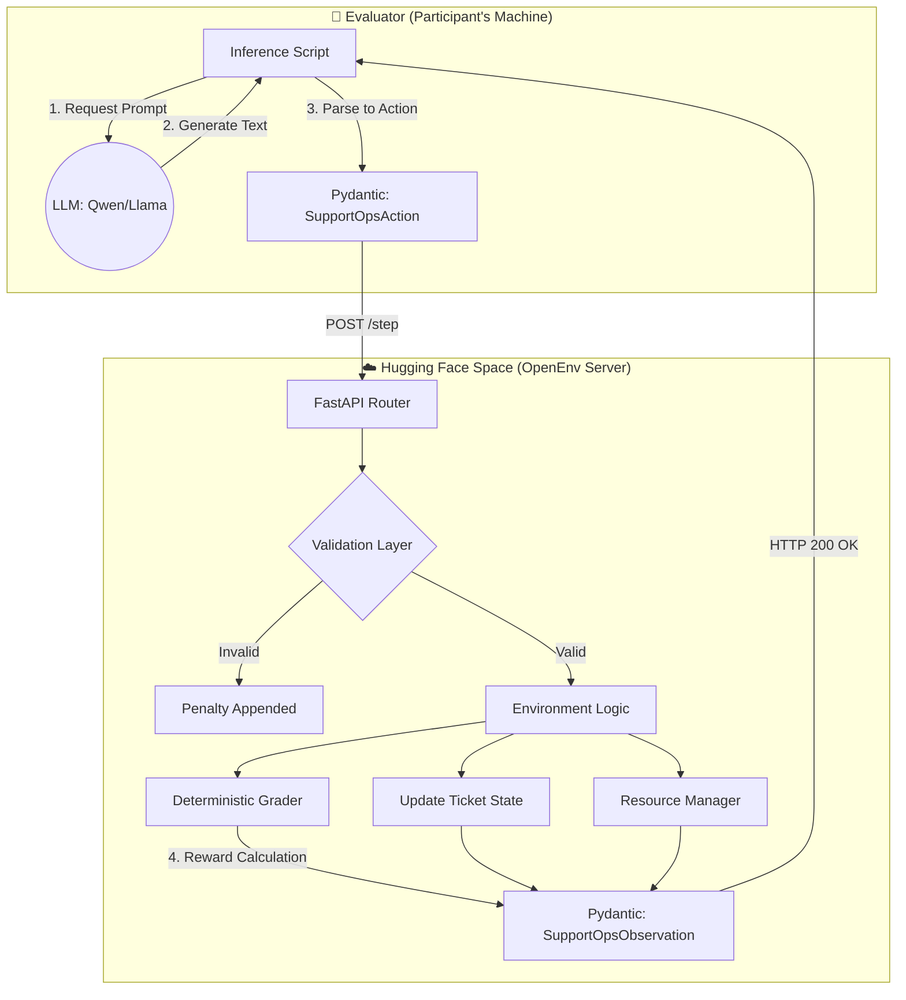
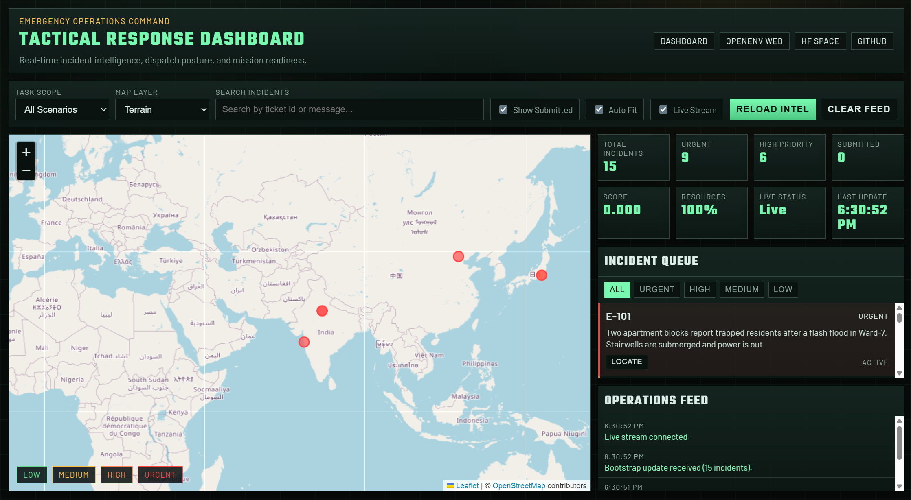
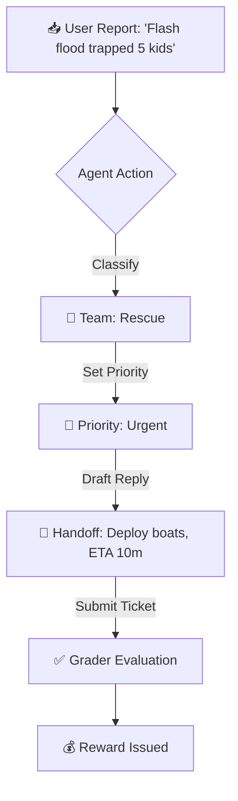

<div align="center">
  <h1>🚨 Disaster Response Coordination OpenEnv</h1>
  <p><strong>A Real-World OpenEnv Simulator for AI Emergency Incident Command</strong></p>

  <p>
    <a href="https://joynnayvedya-disaster-response-openenv.hf.space/ui/?task=all"><strong>Open Tactical Dashboard</strong></a>
    ·
    <a href="https://huggingface.co/spaces/joynnayvedya/disaster-response-openenv"><strong>View Hugging Face Space</strong></a>
  </p>
</div>

---

## 🌪️ The Problem: Scaling Emergency Response
During a natural disaster, **Emergency Operations Centers (EOCs)** are overwhelmed by thousands of frantic calls. Distinguishing between a stranded cat and a chemical plant explosion can mean the difference between life and death.

While most AI environments simulate video games or simple web forms, this OpenEnv simulates the **fog of war**. Agents must route incidents, triage urgency, draft execution plans, and manage extremely limited resources (rescue helicopters, generators, etc.) while avoiding cascading failures.

### 📰 Ripped From The Headlines: Based on True Events
To guarantee **maximum real-world utility**, the 15 simulated scenarios in this environment were directly modeled after operational failures seen in historical disasters:

- **The 2012 North India Grid Failure:** Inspired our "Medium Tier" scenario involving cascading *Cold-Chain Medicine Failures* when massive regional power grids went offline, threatening hospital supply chains.
- **The 2020 Visakhapatnam (Vizag) Gas Leak:** Modeled in our "Hard Tier" as a *Chemical Plant Fire*, requiring the AI agent to prioritize immediate toxic plume evacuations before secondary complications arise.
- **The 2018 Kerala Floods:** The basis for our *Communication Tower Blackouts* and *Dam Spillway Overflows*, forcing the AI to orchestrate multi-district rescue logistics and manage dam reservoir limits without digital comms.

---

## 🏗️ System Architecture

The environment strictly adheres to the OpenEnv REST architecture, ensuring complete decoupling between the AI Agent (Evaluator) and the Environment (Simulator).



---

## 🖥️ UI Dashboard (Judge View)

This project includes **two web experiences**:

- **OpenEnv default web app:** `/web/`
- **Custom command center dashboard (OpenStreetMap):** `/ui/`

### Tactical Dashboard Preview

<p align="center">
  
</p>
<p align="center"><em>Live command center view with incident map, KPI cards, queue, and operations feed.</em></p>

### Judge-Friendly URLs

- Space homepage: [Hugging Face Space](https://huggingface.co/spaces/joynnayvedya/disaster-response-openenv)
- OpenEnv web app path: [OpenEnv Web App](https://joynnayvedya-disaster-response-openenv.hf.space/web/)
- Custom dashboard path: [Command Center Dashboard](https://joynnayvedya-disaster-response-openenv.hf.space/ui/)
- Custom dashboard (preloaded incidents): [Dashboard with task preload](https://joynnayvedya-disaster-response-openenv.hf.space/ui/?task=all)

### What the Custom UI Shows

- Live incident queue with per-ticket urgency colors
- OpenStreetMap markers for all scenario incidents
- Score panel and resource panel for quick judging context
- Real-time updates from backend via WebSocket (`/ws`)

---

## 🏆 Why This Meets All Hackathon Criteria

| Hackathon Criteria | How This Environment Delivers |
|:---|:---|
| **🌍 Real-World Utility (30%)** | Built directly on workflows of FEMA, UN OCHA, and City Emergency Operations Centers. This is not a toy; it is a viable training simulator for humanitarian AI agents. |
| **🧠 Task Quality (25%)** | Features **15 meticulously designed disaster scenarios** ranging from simple power outages to collapsing hospitals and chemical fire evacuations. |
| **🏗️ Environment Design (20%)** | Implements dense, partial rewards. It penalizes agents for looping, hallucinating teams, dismissing tickets, or burning resources. Features explicit multi-turn dependency. |
| **📜 Spec Compliance (15%)** | Full implementation of OpenEnv APIs (`reset`, `step`, `state`) using strictly typed Pydantic models and stateless REST backend. |
| **✨ Creativity (10%)** | Integrates **time-pressure penalties**. Urgent tickets must be resolved within strict step limits, simulating rescue-clock pressure. |

---

## 🎮 The Environment Loop

Agents interact via `SupportOpsAction`. They must complete this workflow for every ticket.



### 🧩 Action Space
| Field | Type | Description |
|-------|------|-------------|
| `action_type` | enum | `classify`, `set_priority`, `draft_reply`, `submit_ticket`, `next_ticket` |
| `predicted_team` | enum | `rescue`, `medical`, `utilities`, `shelter`, `logistics`, `general` |
| `predicted_priority` | enum | `low`, `medium`, `high`, `urgent` |
| `reply_text` | string | Max 2000 chars. Must contain actionable steps. |

### 👁️ Observation Space
Agents receive trajectory-aware context:

- **Inbox:** Real-time completion status of all active tickets
- **Metadata limits:** `resource_budget` tracking remaining fuel/manpower
- **Feedback:** `last_action_error` to break loops and invalid actions

---

## 🔥 Difficulty Scaling (15 Total Scenarios)

We implemented 3 deterministic difficulty tiers. Each tier features 5 parallel emergencies.

### 🟢 Easy (Budget: 40)
*Clear, single-team incidents.*

Examples: stranded school bus (Rescue), shelter water shortage (Shelter), residential gas line crack (Utilities).

### 🟡 Medium (Budget: 48)
*Multi-agency incidents with ambiguity.*

Examples: highway pileup blocking ambulance lanes, clinic cold-chain failure, flood cutting off two villages.

### 🔴 Hard (Budget: 55)
*Cascading mass-casualty scenarios with time-pressure constraints.*

Examples: dam spillway overflow, hospital wing collapse, chemical plant fire with toxic plume.

*(Hard mode enforces score deductions when urgent incidents are delayed too long.)*

---

## ⚖️ Grader & Reward System

### Partial, Dense Rewards

To prevent sparse signaling, agents receive incremental rewards:

- `+0.35` for correct team classification
- `+0.30` for correct priority
- Loop/noop penalties accumulate (`-0.015` style task penalties)

### Final Composite Score (0.0 - 1.0)
When a ticket is submitted:

1. **Routing accuracy (40%)**
2. **Priority precision (30%)**
3. **Handoff quality (30%)**

---

## 🚀 Quickstart & Setup

### 1. Installation
```bash
git clone https://github.com/letsjoyn/meta-scalar-hack.git
cd meta-scalar-hack
pip install -e .
```

### 2. Local Demo (Smoke Test)
Run deterministic baseline behavior (no API key required):

```bash
py smoke_test.py
```

Expected output: all 3 tasks should pass with scores in `[0.0, 1.0]`.

### 3. Run Server + UI

```bash
py -m server.app
```

Open locally:

- OpenEnv web app: `http://127.0.0.1:8000/web/`
- Custom dashboard: `http://127.0.0.1:8000/ui/`

### 4. LLM Inference Script
Run baseline agent against environment:

```bash
# Windows PowerShell
$env:API_BASE_URL="https://router.huggingface.co/v1"
$env:MODEL_NAME="Qwen/Qwen2.5-72B-Instruct"
$env:HF_TOKEN="hf_YOUR_OWN_TOKEN_HERE"
py inference.py
```

---

## 🌐 Deployment & Validation

This project is Hugging Face Spaces compatible:

- Dockerized and rootless (`USER appuser`)
- OpenEnv compliant (`reset`, `step`, `state`)
- Built for CPU-basic deployment footprint

Validation:

```bash
openenv validate
```

---

*Built for the 2026 Meta & Scalar AI Hackathon.*
