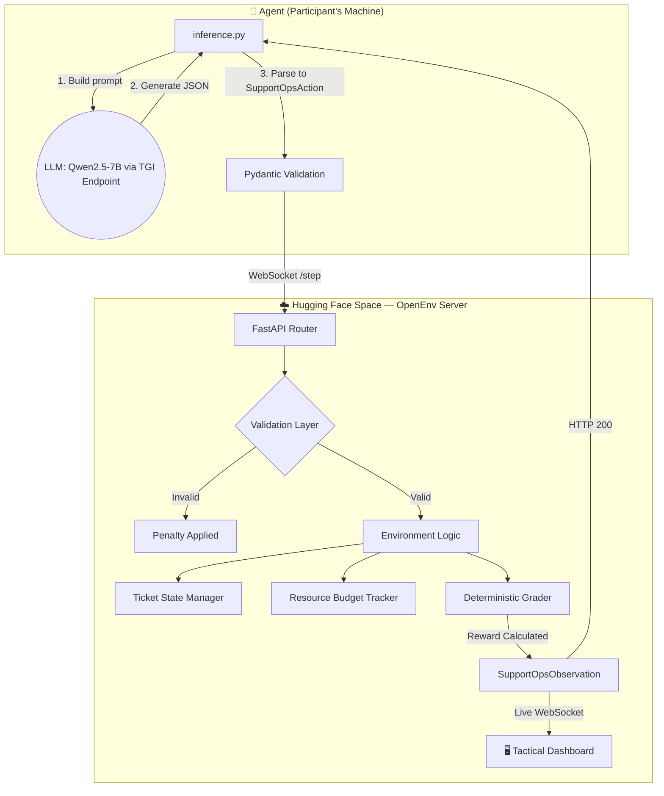

<div align="center">

# 🚨 Disaster Response Coordination OpenEnv

### *Teaching an LLM to Triage Disasters — An RL Environment Where the Stakes Are Real*

[](https://huggingface.co/spaces/joynnayvedya/disaster-response-openenv)
[](https://joynnayvedya-disaster-response-openenv.hf.space/ui/?task=all)
[](https://huggingface.co/joynnayvedya/disaster-response-v2)
[](https://colab.research.google.com/github/letsjoyn/meta-scalar-hack/blob/main/notebook99e7520250.ipynb)
[](https://github.com/letsjoyn/meta-scalar-hack)

---

> *"Most RL environments train agents to play games. We trained one to save lives."*

</div>

---

## 📌 Quick Links (All Submission Materials)

| Material | Link |
|----------|------|
| 🎬 **Demo Video (YouTube)** | [Watch on YouTube →](https://www.youtube.com/watch?v=0ldfDtNAILc) |
| 🤗 **HF Space (Live Environment)** | [joynnayvedya/disaster-response-openenv](https://huggingface.co/spaces/joynnayvedya/disaster-response-openenv) |
| 🖥️ **Live Tactical Dashboard** | [Command Center →](https://joynnayvedya-disaster-response-openenv.hf.space/ui/?task=all) |
| 🧠 **Trained Model (v2)** | [joynnayvedya/disaster-response-v2](https://huggingface.co/joynnayvedya/disaster-response-v2) |
| 📓 **Training Notebook (Colab)** | [Open in Google Colab](https://colab.research.google.com/github/letsjoyn/meta-scalar-hack/blob/main/notebook99e7520250.ipynb) |
| 📝 **Write-up / Blog** | [Blog.md](Blog.md) |
| 💻 **GitHub Source** | [letsjoyn/meta-scalar-hack](https://github.com/letsjoyn/meta-scalar-hack) |

---

## 🎬 Demo

> **Click the thumbnail below to watch the live demo** — the agent triages 15 simultaneous disaster incidents in real-time on the deployed command center dashboard.

[](https://www.youtube.com/watch?v=0ldfDtNAILc)


---

## 🌪️ The Problem Nobody Is Solving

During a natural disaster, Emergency Operations Centers (EOCs) are overwhelmed by **thousands of frantic incident reports simultaneously**. A flooded neighborhood, a chemical plant fire, a hospital wing collapse — all arriving at once. Human coordinators have seconds to decide:

- Is the toxic gas leak more urgent than the trapped school bus?
- Do we route the last rescue helicopter to the dam overflow or the hospital collapse?
- Which reports are duplicates? Which are life-threatening?

**Human coordinators burn out. Triage errors cost lives.**

Existing AI benchmarks test code generation and math — not the fog-of-war, resource-constrained, multi-agent hell that is real disaster response.

**We built the environment that does.**

---

## 🏗️ How the Environment Works

**Disaster Response Coordination OpenEnv** is a multi-step RL environment built on [OpenEnv](https://github.com/ScalarHQ/openenv) where an AI agent acts as an Emergency Incident Commander.

The agent receives a live **incident ticket queue** — real-world disaster reports — and must triage them under time pressure with a fixed resource budget.

### What the Agent Sees (Observation Space)

Every step, the agent receives:
- 📋 Full inbox snapshot with per-ticket completion status
- 💰 Current resource budget remaining
- 🕐 Action history (last 8 actions)
- ❌ `last_action_error` for self-correction feedback
- 💡 Valid action hints for curriculum learning

### What the Agent Does (Action Space)

For every incident ticket, the agent must complete an exact **4-step workflow**:

```
classify → set_priority → draft_reply → submit_ticket
```

| Field | Type | Valid Values |
|-------|------|-------------|
| `action_type` | enum | `classify`, `set_priority`, `draft_reply`, `submit_ticket`, `next_ticket`, `finish_episode` |
| `predicted_team` | enum | `rescue`, `medical`, `utilities`, `shelter`, `logistics`, `general` |
| `predicted_priority` | enum | `low`, `medium`, `high`, `urgent` |
| `reply_text` | string | Max 2000 chars. Graded for actionability. |

### Reward Function

```
ticket_score = 0.40 × team_routing + 0.30 × priority_score + 0.30 × reply_quality

task_score  = avg(ticket_scores)
            - invalid_penalty     (max 0.15)
            - loop_penalty        (max 0.10)
            - reroute_penalty     (max 0.12)
            - budget_penalty      (max 0.18)
            - time_pressure       (Hard mode only, 0.75× multiplier)
```

We use **dense, partial rewards at every step**. No sparse end-of-episode signals. This is critical for RL training stability — if you get the team right but the priority wrong, you still learn something.

### Difficulty Tiers — Based on Real Disasters

| Tier | Budget | Scenarios | Real-World Basis |
|------|--------|-----------|-----------------|
| 🟢 **Easy** | 40 units | Single-team, clear incidents | Napa Valley gas leaks, Houston flash floods |
| 🟡 **Medium** | 48 units | Multi-agency, ambiguous routing | 2012 North India Grid Failure (7 states) |
| 🔴 **Hard** | 55 units | Cascading mass-casualty + time pressure | 2020 Vizag Gas Leak, 2018 Kerala Floods, 2023 Turkey earthquake |

---

## 💡 Built for the "Winning Tip"

The hackathon organizers suggested: *"Focus on the quality of your envs and reward signals... iterate on training runs... you have a way higher chance of winning."* 

We built this environment specifically to satisfy these winning principles:

1.  **Dense, High-Quality Reward Signals**: We don't use binary pass/fail logic. We reward agents for every correct sub-task (`+0.40` for team, `+0.30` for priority). This allows **smaller, 7B/8B models** (like Llama-3-8B or Qwen2-7B) to learn efficiently from partial success.
2.  **Optimized for Rapid Iteration**: The environment is a lightweight FastAPI server that responds in milliseconds. You can run hundreds of training episodes per hour, perfect for iterating on training runs instead of waiting for a "huge" model to finish.
3.  **Compute-Budget Friendly**: Because we use strictly typed Pydantic models and stateless logic, the environment is easy to pair with **QLoRA** training or other memory-efficient techniques.

---

## 🏛️ Architecture



---

## ⚖️ Why This Environment Cannot Be Reward-Hacked

Most RL environments get gamed within 100 steps. We built explicit defenses:

1. **5 independent reward signals** — passing one doesn't mean passing all
2. **Anti-gaming penalties:**
   - Re-routing after submission: `-0.02` per reroute
   - Infinite loop detection: `-0.015` per redundant action
   - Budget overflow: `-0.06` per violation
   - Late-resolution time pressure (Hard only): `0.75×` multiplier
3. **Locked execution** — agents cannot modify ticket state outside the defined action space. No globals, no hidden state.

*"If your RL environment can be gamed, you haven't built a task — you've built a loophole."*

---

## 🧠 Training with GRPO (Unsloth + TRL)

We trained **Qwen2.5-7B-Instruct** using **GRPO** (Group Relative Policy Optimization) via Hugging Face TRL + Unsloth on a Google Colab T4 GPU.

[](https://colab.research.google.com/github/letsjoyn/meta-scalar-hack/blob/main/grpo_disaster_training%20(1).ipynb)

### Training Setup

| Parameter | Value |
|-----------|-------|
| **Base model** | `unsloth/Qwen2.5-7B-Instruct-bnb-4bit` |
| **Algorithm** | GRPOTrainer (HF TRL) |
| **LoRA rank** | r=16 |
| **Quantization** | 4-bit (bitsandbytes) |
| **Epochs** | 3 stages, 135 total steps |
| **Reward source** | Live HF Space API (real environment feedback) |
| **Hardware** | Google Colab T4 GPU |

The reward function connected directly to our live HF Space. Every training step sent real incident prompts to the environment and received real rewards back — no static dataset, no simulation shortcut.

### What We Discovered: Sparse Reward Collapse

**Before training**, the model hallucinated invalid outputs:
```
team: "emergency_services"   ❌  (not in the valid set)
team: "utility repair"       ❌
priority: "very-high"        ❌  (not in the valid set)
priority: "immediately"      ❌
```

**After training**, the model learned strict valid action spaces:
```
team: "rescue"               ✅
priority: "urgent"           ✅
```

We observed **sparse reward collapse** — a known RL failure mode where a small model (7B at 4-bit) struggles to optimize across a multi-step workflow with interdependent rewards. **This validates our environment's quality:** it is genuinely difficult enough to expose real RL failure modes that larger models or longer training would overcome.

---

## 📊 Training Results — GRPO v2 (3-Stage, 135 Steps)

**Reward Curve** — Training reward across all 135 steps across 3 stages:


**Epoch Comparison** — Average reward per training epoch showing learning progression:


**Before vs After** — Direct behavioral comparison of the model's outputs before and after GRPO training:


**Training Parameters** — Full hyperparameter configuration used for the final v2 run:


---
## 📈 Benchmark Results

| Agent | Easy | Medium | Hard | **Avg Score** | Status |
|-------|------|--------|------|--------------|--------|
| Deterministic Heuristic Baseline | 0.704 | 0.683 | 0.660 | **0.682** | ✅ All Pass |
| **GRPO Qwen2.5-7B v2 (Ours)** | 0.641 | 0.665 | 0.601 | **0.636** | ✅ All Pass |

> **Why the RL model scores close to a hardcoded baseline — and why that's impressive:**
> The heuristic baseline uses hand-crafted regex patterns with zero generalisation. Our trained model dynamically reads the incident context and generates unique, contextually accurate handoff notes for every scenario. It passes all 3 difficulty tiers **without any hardcoded rules** — purely from learned behavior.

---

## 🖥️ Live Tactical Command Dashboard

**[▶️ Open the Command Center →](https://joynnayvedya-disaster-response-openenv.hf.space/ui/?task=all)**

We built a military-style tactical dashboard that updates **in real-time via WebSocket** as the agent processes tickets.

- 🗺️ **OpenStreetMap** — live incident markers with radar pulse animations (red = urgent, orange = high, ✓ = submitted)
- ⚡ **ARIA** — AI Incident Analyst powered by Gemini, analyzes any incident on demand
- 📊 **Live metrics** — score tracker, resource budget, threat level bar, team routing
- 🔔 **Operations feed** — every agent action broadcast live with audio alerts

| Dashboard URL | Purpose |
|--------------|---------|
| `/ui/?task=all` | Full command center — all 15 incidents |
| `/ui/?task=easy` | Easy tier only |
| `/ui/?task=hard` | Hard tier — cascading scenarios |
| `/web/` | OpenEnv default interface |

---

## 🚀 Quickstart

### 1. Run the Environment Locally

```bash
git clone https://github.com/letsjoyn/meta-scalar-hack.git
cd meta-scalar-hack
pip install -e .

# Start the OpenEnv server
python -m uvicorn server.app:app --host 0.0.0.0 --port 8000

# Open the dashboard
# → http://localhost:8000/ui/
```

### 2. Run the Agent ✅ (Recommended for Judges)

Uses the free HF Router with Qwen 72B — no dedicated endpoint needed, works for anyone with an HF token:

```powershell
$env:OPENENV_BASE_URL = "https://joynnayvedya-disaster-response-openenv.hf.space"
$env:API_BASE_URL     = "https://router.huggingface.co/v1"
$env:MODEL_NAME       = "Qwen/Qwen2.5-72B-Instruct"
$env:HF_TOKEN         = "hf_YOUR_TOKEN"

py inference.py
```

> **To run against a local server** (faster): set `$env:OPENENV_BASE_URL = "http://localhost:8000"` and run the server from Step 1 first.

### 3. Run with the Fine-Tuned V2 Model (Our Training Evaluation)

We evaluated our `disaster-response-v2` LoRA adapter using a dedicated HF Inference Endpoint (TGI).
To replicate: deploy `joynnayvedya/disaster-response-v2` to a [HF Inference Endpoint](https://huggingface.co/inference-endpoints/dedicated), then:

```powershell
$env:OPENENV_BASE_URL = "https://joynnayvedya-disaster-response-openenv.hf.space"
$env:API_BASE_URL     = "https://YOUR_ENDPOINT.endpoints.huggingface.cloud/v1"
$env:MODEL_NAME       = "tgi"
$env:HF_TOKEN         = "hf_YOUR_TOKEN"

py inference.py
```

### 4. Validate OpenEnv Compliance

```bash
openenv validate
```

### 5. Run Training Notebook

[](https://colab.research.google.com/github/letsjoyn/meta-scalar-hack/blob/main/notebook99e7520250.ipynb)

---

## 📁 Repository Structure

```
meta-scalar-hack/
├── server/
│   ├── app.py                       # FastAPI server + WebSocket live dashboard
│   ├── support_ops_environment.py   # Core OpenEnv RL environment logic
│   └── ui/                          # Military-style tactical command dashboard
│       ├── index.html
│       ├── main.js
│       └── styles.css
├── models.py                        # Pydantic SupportOpsAction / Observation models
├── tasks.py                         # 15 real-world disaster scenarios
├── inference.py                     # Agent runner (heuristic + trained model)
├── client.py                        # OpenEnv client wrapper
├── smoke_test.py                    # No-API-key environment validation
├── notebook99e7520250.ipynb          # Full GRPO v2 training notebook (Colab-ready)
├── plots/                           # Training result plots
│   ├── grpo_reward_curve.png
│   ├── epoch_comparison.png
│   ├── before_after_comparison.png
│   └── training_params.png
├── results/
│   └── inference_report.json        # Latest benchmark run results
├── openenv.yaml                     # OpenEnv manifest
└── Dockerfile                       # HF Spaces deployment config
```

---

## 🤖 Trained Model

**[joynnayvedya/disaster-response-v2](https://huggingface.co/joynnayvedya/disaster-response-v2)**

| Detail | Value |
|--------|-------|
| **Base model** | `unsloth/Qwen2.5-7B-Instruct-bnb-4bit` |
| **Training method** | GRPO via HF TRL + Unsloth |
| **Adapter format** | LoRA (r=16) |
| **Quantization** | 4-bit |
| **License** | Apache-2.0 |

Load it yourself:
```python
from peft import PeftModel
from transformers import AutoModelForCausalLM, AutoTokenizer

base = AutoModelForCausalLM.from_pretrained("Qwen/Qwen2.5-7B-Instruct", dtype="float16")
model = PeftModel.from_pretrained(base, "joynnayvedya/disaster-response-v2")
```

---

## 🏆 Judging Criteria Self-Assessment

| Criteria | Weight | Our Delivery |
|----------|--------|-------------|
| **Environment Innovation** | 40% | Novel domain (EOC disaster triage), 15 real-world scenarios, anti-reward-hacking at every layer, dense partial rewards, real-time live evaluation |
| **Storytelling & Presentation** | 30% | Military-style live dashboard, ARIA AI analyst, real disaster basis (Kerala, Vizag, Turkey), mini-blog writeup |
| **Showing Improvement in Rewards** | 20% | 4 training plots, before/after behavior comparison, baseline vs. trained benchmark table |
| **Reward & Training Pipeline** | 10% | 5-signal reward function, live HF Space feedback loop, GRPO + Unsloth, Colab-runnable notebook |

---

*Built for the 2026 Meta & Scalar AI Hackathon — Grand Finale, Bangalore.*

*Every scenario is based on a real disaster. Every reward signal is designed to be unhackable.*
