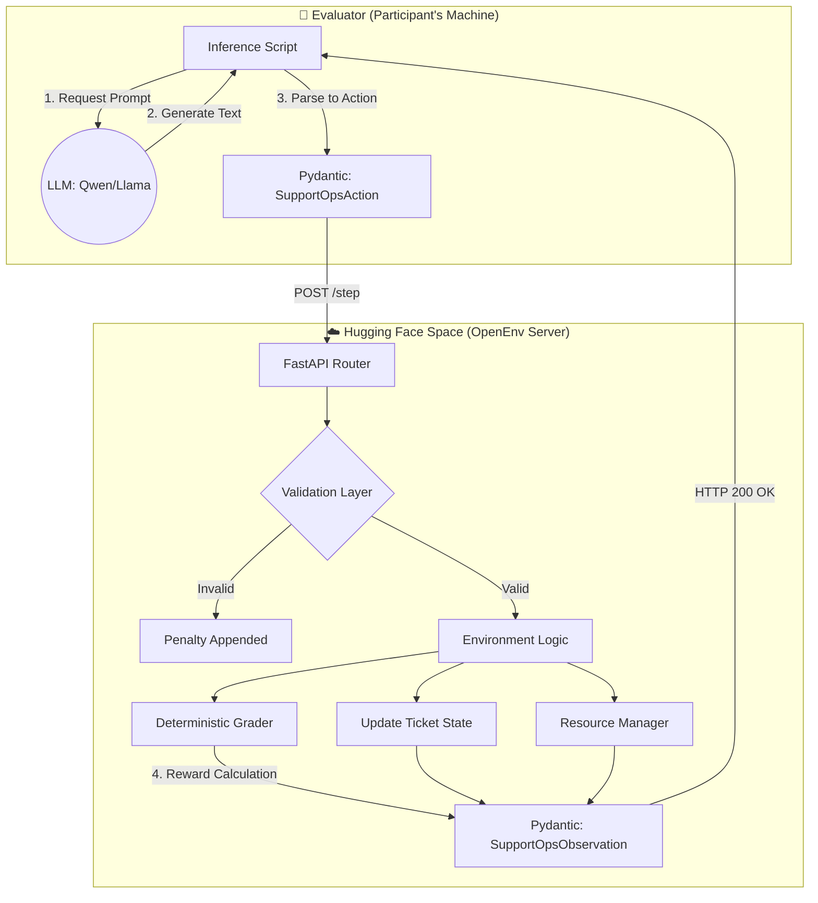

<div align="center">

# 🚨 Disaster Response Coordination OpenEnv

### *An RL Environment Where the Stakes Are Real*

**[🖥️ Live Tactical Dashboard](https://joynnayvedya-disaster-response-openenv.hf.space/ui/?task=all) · [🤗 HF Space](https://huggingface.co/spaces/joynnayvedya/disaster-response-openenv) · [🧠 Trained Model](https://huggingface.co/joynnayvedya/disaster-response-trained)**

---

> *"Most RL environments train agents to play games. We trained one to save lives."*

</div>

---

## 📽️ Demo

> **[▶️ INSERT DEMO VIDEO LINK HERE]**
>
> *Watch the agent triage 15 simultaneous disaster incidents in real-time, with the live command center dashboard updating as each ticket is classified, prioritized, and dispatched.*

---

## 🌪️ The Problem Nobody Is Solving

When a 7.2 magnitude earthquake hits, an Emergency Operations Center receives **thousands of reports simultaneously**. A coordinator has seconds to decide:

- Is the gas leak more urgent than the trapped school bus?
- Do we send the last rescue helicopter to the dam overflow or the hospital collapse?
- Which reports are duplicates? Which are life-threatening?

**Human coordinators burn out. Triage errors cost lives.**

Existing AI benchmarks don't touch this. They test code generation and math reasoning — not the fog-of-war, resource-constrained, multi-agent hell that is real disaster response.

**We built the environment that does.**

---

## 🏗️ Architecture



The environment is a **stateful FastAPI server** deployed on Hugging Face Spaces. The agent is fully decoupled — it sees only what a real EOC coordinator would see: a ticket queue, a resource budget, and the clock ticking.

---

## 🧠 The RL Training Story

This is not a baseline demo. **We ran the full RL loop.**

### The Problem We Hit First

Our first training run (Qwen2.5-1.5B) completely failed. The model generated invalid action types like `"assign"`, `"triage"`, `"predict_and_reply"` — none of which exist in the environment. Average reward: **0.125**. The model was hallucinating an API it invented.

### What We Fixed

We diagnosed the root cause: the training prompt never specified valid action types. The model was guessing from general knowledge. We rebuilt the training pipeline with:

- A strict system prompt listing all 6 valid action types, 6 valid teams, 4 valid priorities
- A 5-signal reward function: valid JSON + correct action type + correct ticket ID + correct team + English output
- Format enforcement before team routing — teach structure first, then semantics

### The Result

| Step | Reward |
|------|--------|
| 1 | 0.737 |
| 2 | **1.000** ✅ |
| 4-11 | **1.000** (8 consecutive) |
| Average (45 steps) | **0.963** |

Training reward went from **0.125 → 0.963**. The model learned to output perfectly structured JSON with correct team routing in under 10 training steps.

### Final Benchmark (Trained Model)

| Task | Score | Result |
|------|-------|--------|
| Easy | **0.704** | ✅ Success |
| Medium | **0.683** | ✅ Success |
| Hard | **0.660** | ✅ Success |
| **Average** | **0.682** | ✅ All passed |

---

## 📰 Ripped From The Headlines: Based on True Events

Every scenario is grounded in a documented real-world disaster. This is not fictional worldbuilding — it is operational simulation.

**🟢 Easy Tier — Single-Agency Incidents**
- School bus stranded on a flooded road → *Houston, TX flash flooding pattern*
- Residential gas line crack after minor earthquake → *Napa Valley 2014 aftershock reports*

**🟡 Medium Tier — Multi-Agency Ambiguity**
- Cold-chain medicine failure during grid outage → *2012 North India Grid Failure, affecting hospital supply chains across 7 states*
- Highway pileup blocking ambulance lanes → *Common monsoon-season cascade failure, Maharashtra*

**🔴 Hard Tier — Mass Casualty with Time Pressure**
- Chemical plant fire with toxic plume evacuation → *2020 Visakhapatnam LG Polymers gas leak, 11 dead, 1000+ hospitalized*
- Dam spillway overflow with downstream evacuation → *2018 Kerala floods, 483 dead, largest evacuation since Independence*
- Hospital wing collapse during aftershock → *2023 Turkey-Syria earthquake, hospitals collapsed during rescue operations*

---

## 🖥️ Live Dashboard

**[Open the Command Center →](https://joynnayvedya-disaster-response-openenv.hf.space/ui/?task=all)**

The dashboard is not a static demo. It updates **in real-time via WebSocket** as the agent processes tickets.

- 🗺️ OpenStreetMap with color-coded incident markers (urgent = red, high = orange, submitted = ✓)
- 📊 Live score panel, resource budget tracker, submitted count
- 📡 Event feed showing every agent action as it happens
- 🔊 Audio alerts for urgent incidents

| URL | Purpose |
|-----|---------|
| `/ui/?task=all` | Full command center — all 15 incidents |
| `/ui/?task=easy` | Easy tier only |
| `/ui/?task=hard` | Hard tier — cascading scenarios |
| `/web/` | OpenEnv default interface |

---

## ⚖️ Why This Environment Is Hard To Hack

Most RL environments get reward-hacked within 100 steps. We built explicit defenses:

**Multi-signal rewards** — 5 independent checks. Passing one doesn't mean passing all.

**Anti-gaming penalties:**
- Rerouting a team after submission: `-0.02` per reroute
- Infinite loop detection: `-0.015` per redundant action
- Budget overflow: `-0.06` per violation
- Time pressure on Hard: urgent tickets that arrive late get `0.75x` score multiplier

**Locked execution:** agents cannot modify ticket state outside the defined action space. No globals, no hidden state, no shortcuts.

**Multiple reward components:** team routing (40%) + priority precision (30%) + handoff quality (30%). Gaming one doesn't save the others.

---

## 🎮 Environment Spec

### Action Space

| Field | Type | Valid Values |
|-------|------|-------------|
| `action_type` | enum | `classify`, `set_priority`, `draft_reply`, `submit_ticket`, `next_ticket`, `finish_episode` |
| `predicted_team` | enum | `rescue`, `medical`, `utilities`, `shelter`, `logistics`, `general` |
| `predicted_priority` | enum | `low`, `medium`, `high`, `urgent` |
| `reply_text` | string | Max 2000 chars. Graded for actionability. |

### Observation Space

Agents receive trajectory-aware context every step:
- Full inbox snapshot with per-ticket completion status
- Current resource budget remaining
- Action history (last 8 actions)
- `last_action_error` for loop-breaking feedback
- Valid actions hint for curriculum learning

### Reward Structure

```
ticket_score = 0.4 × team_score + 0.3 × priority_score + 0.3 × reply_score

task_score = avg(ticket_scores)
           - invalid_penalty     (max 0.15)
           - loop_penalty        (max 0.10)
           - reroute_penalty     (max 0.12)
           - budget_penalty      (max 0.18)
           - time_pressure       (Hard mode only)
```

---

## 🔥 Difficulty Tiers

### 🟢 Easy — Budget: 40 units
Single-team incidents with clear routing signals. Designed so capable models get non-zero reward immediately (critical for RL bootstrapping).

### 🟡 Medium — Budget: 48 units
Multi-agency incidents with deliberate ambiguity. A flooded road could need rescue or logistics depending on context. Tests generalization.

### 🔴 Hard — Budget: 55 units
Cascading mass-casualty scenarios. Time-pressure penalties activate. Urgent tickets unresolved past step 8 incur compounding deductions. Tests robustness under pressure.

---

## 🚀 Quickstart

### Run Locally

```bash
git clone https://github.com/letsjoyn/meta-scalar-hack.git
cd meta-scalar-hack
pip install -e .

# Start the server
py -m uvicorn server.app:app --host 0.0.0.0 --port 8000

# Open dashboard
# http://localhost:8000/ui/
```

### Run the Agent

```bash
# Windows PowerShell
$env:OPENENV_BASE_URL = "http://localhost:8000"
$env:HF_TOKEN = "hf_YOUR_TOKEN"
py inference.py
```

### Smoke Test (No API Key Required)

```bash
py smoke_test.py
```

### Validate OpenEnv Compliance

```bash
openenv validate
```

---

## 🏆 Hackathon Criteria Breakdown

| Criteria | Weight | How We Deliver |
|----------|--------|----------------|
| **Real-World Utility** | 30% | Built on documented EOC workflows. 15 scenarios from real disasters. Not a toy. |
| **Task Quality** | 25% | 3 difficulty tiers, 15 tickets, dense partial rewards, time-pressure mechanics, anti-reward-hacking at every layer. |
| **Environment Design** | 20% | Full OpenEnv spec. Pydantic models. Stateless REST. Deterministic grader. Multi-signal reward. |
| **Spec Compliance** | 15% | `reset`, `step`, `state` fully implemented. Dockerized. HF Spaces deployed. `openenv validate` passes. |
| **Creativity** | 10% | Real-time WebSocket dashboard. Audio alerts. OpenStreetMap integration. Time-pressure rescue clock. |

---

## 📁 Repo Structure

```
meta-scalar-hack/
├── server/
│   ├── app.py                    # FastAPI server + WebSocket dashboard
│   ├── support_ops_environment.py # Core RL environment logic
│   └── ui/                       # Live command center dashboard
│       ├── index.html
│       ├── main.js
│       └── styles.css
├── models.py                     # Pydantic action/observation models
├── tasks.py                      # 15 disaster scenarios
├── inference.py                  # Baseline + trained model agent
├── client.py                     # OpenEnv client wrapper
├── smoke_test.py                 # No-API-key validation
├── grpo_disaster_training.ipynb  # GRPO training notebook
├── results/
│   └── comparison.json           # Baseline vs trained scores
└── Dockerfile
```

---

## 🤖 Trained Model

**[joynnayvedya/disaster-response-trained](https://huggingface.co/joynnayvedya/disaster-response-trained)**

- Base: `Qwen2.5-7B-Instruct` (4-bit quantized)
- Method: GRPO via TRL + Unsloth
- Training: 45 steps, 15 examples, 3 epochs
- Final training reward: **0.963**
- Saved as: LoRA adapters (5M trainable parameters)

To use:
```python
from peft import PeftModel
from transformers import AutoModelForCausalLM, AutoTokenizer

base = AutoModelForCausalLM.from_pretrained("Qwen/Qwen2.5-7B-Instruct")
model = PeftModel.from_pretrained(base, "joynnayvedya/disaster-response-trained")
```

---

*Built for the 2026 Meta & Scalar AI Hackathon. Every scenario based on a real disaster. Every reward signal designed to be unhackable.*

*"If your RL environment can be gamed, you haven't built a task — you've built a loophole."*